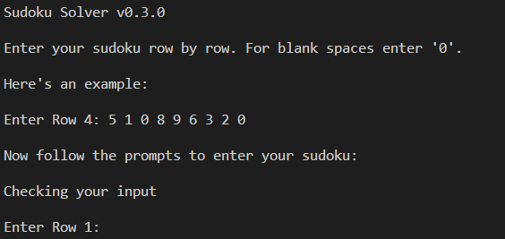

# Sudoku Solver

A command line python script that takes in user input of a sudoku, row by row, and finds the solution using a backtracking algorithm.

## Installation

_Note this requires Python 3 to run._

Download the sudoku.py python script.

## Usage

Run the script in command line using:

```
python sudoku.py
```

Then follow the commands to enter your sudoku.



The input should be whole numbers with a space separating them. Empty spaces in your sudoku should be entered as '0'.

## The Solving Algorithm

With a quick search I found the most common algorithm used for sudoku solving is called a 'back-tracking algorithm' - I did not look at any examples of this although I did see the following visualization of it as a gif:


The algorithm finds the first empty sqaure and tries a number that isn't in the same row, column or box (as dictated by the rules of sudoku). It then recursively calls the same algorithm with this trial entry as part of the sudoku. If no numbers are eligible to fit the next empty space then it raises an exception and the algorithm tries the next possible number in the previous empty space.

In this way, all entries will eventually be filled and so the solution has been found.


## Features to be implemented

* Methods to catch more possibilities of wrong user input
* GUI interface for input and/or output
* Improving efficiency of main algorithm

## Release History

* 0.2.0
    * ADD: Added `isCorrect()` to check whether solution to sudoku follows sudoku rules
* 0.1.0
    * Initial release